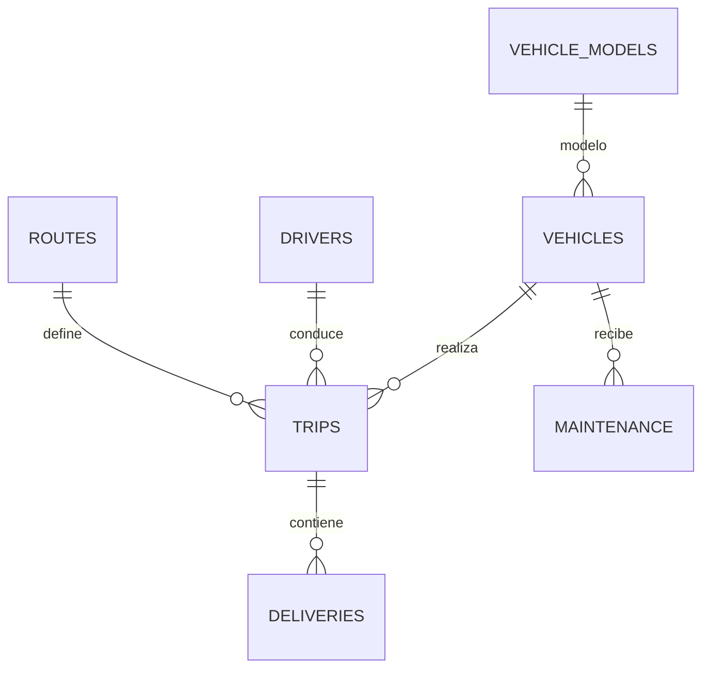

# FleetLogix — Proyecto Integrador  
**Autor: Federico Ceballos Torres — SoyHenry**

## Modernización de Infraestructura de Datos Logísticos

### Descripción General

**FleetLogix** es una empresa de logística urbana que opera 200 vehículos realizando entregas de última milla en 5 ciudades.  
El objetivo del proyecto es modernizar la infraestructura de datos, poblar una base PostgreSQL desde cero con más de **500.000 datos sintéticos realistas**, garantizar **integridad total** y preparar la base para **análisis operativos avanzados**.

---

## ✅ Avances incluidos

- Reconstrucción del esquema de datos.
- Normalización en modelo **Snowflake ligero** (a través de subtablas).
- Generación sintética coherente de **505.000 registros**.
- Corrección e importación fiable de datos a PostgreSQL.
- Validación de calidad, integridad y consistencia temporal.

---

## 1) Modelo de Datos

La base contiene 6 tablas core:

| Tabla           | Tipo           | Descripción                                 |
|----------------|----------------|---------------------------------------------|
| vehicle_models | Dimensión      | Modelos y categorías de vehículos           |
| vehicles       | Maestro        | La flota de 200 vehículos                   |
| drivers        | Maestro        | 400 conductores y licencias                 |
| routes         | Maestro        | 50 rutas entre 5 ciudades                   |
| trips          | Transaccional  | 100k viajes realizados en 2 años            |
| deliveries     | Transaccional  | 400k entregas asociadas a los viajes        |
| maintenance    | Transaccional  | ~5k mantenimientos programados              |

### Relaciones y normalización

- `vehicle_models → vehicles`
- `vehicles → maintenance`
- `drivers → trips`
- `routes → trips`
- `trips → deliveries`

### Diagrama ER

## 2) Generación de Datos Sintéticos

### Script: fleetlogix_data_generator.py
- El script genera todos los CSV (vehicles, drivers, routes, trips, deliveries, maintenance).
- Asegura integridad referencial completa.
- Consistencia temporal estricta (arrival > departure).
- Mantenimiento cada +- 20 viajes.
- 4 entregas promedio por viaje.
- Produce datos realistas basados en:
- Distribución horaria inteligente (get_hourly_distribution()).
- Probabilidades ajustadas para fallas, accidentes y demoras.
- 5 ciudades principales definidas por la empresa.

Librerías utilizadas: Faker, pandas, NumPy, datetime, random.

Salida: Todos los CSV generados quedan en /data/, listos para importar a PostgreSQL.

## 3) Creación de Tablas

### Script: fleetlogix_tables.sql
- Este script elimina todas las tablas previas (DROP IF EXISTS).
- Crea el modelo final 100% consistente con los CSV.
- Define: 
    - Primary Keys
    - Foreign Keys
- Tipos de datos adecuados (numeric, timestamp, varchar)
- Constraints de integridad y normalización

## 4) Carga de Datos a PostgreSQL (DBeaver)

Importación manual de cada CSV asegurando así:
- Routes:
Ajustada tabla para coincidir exactamente con el CSV:
    - route_code
    - origin_city
    - destination_city
    - distance_km
    - estimated_duration_hours
    - toll_cost

- Deliveries / Maintenance:
Se corrigieron tipos numéricos, fechas y claves foráneas.
Se activó correctamente "Truncate target table" cuando fue necesario.
Elimina todas las tablas previas (DROP IF EXISTS).

Crea el modelo final 100% consistente con los CSV.

Importación controlada por lotes.

### Define:
- Primary Keys
- Foreign Keys
- Tipos de datos adecuados (numeric, timestamp, varchar)
- Constraints de integridad (CHECK, UNIQUE cuando aplica)

## 5) Validación de Calidad

### Integridad referencial:
Todos los vehicle_id, driver_id, route_id y trip_id existen. No hay claves huérfanas ni entregas vinculadas a viajes inválidos.

### Consistencia temporal:
departure_datetime < arrival_datetime
scheduled_datetime < delivered_datetime
Mantenimiento posterior al viaje previo

### Distribución realista:
100k viajes distribuidos durante 2 años
400k entregas asociadas
Mantenimientos con frecuencia lógica

## 6) Modelo Híbrido (Star + Snowflake)

### El modelo de datos final de FleetLogix no es puramente estrella ni puramente snowflake, sino un modelo híbrido.

¿Por qué no es completamente estrella?
En un esquema estrella puro la tabla de hechos se conecta directamente a dimensiones desnormalizadas.
En FleetLogix trips y deliveries sí son tablas de hechos, pero las dimensiones como vehicles, drivers, routes no están totalmente desnormalizadas.

¿Por qué no es completamente snowflake?
En un copo de nieve puro las dimensiones se dividen en subdimensiones normalizadas.
En FleetLogix hay normalización parcial:
- routes → cities
- vehicles → vehicle_models
- vehicles → maintenance
Pero no se llega a una normalización total.

### Diagrama del modelo híbrido
#### Tabla descriptiva
| Elemento | Característica | Tipo |
| trips y deliveries | tablas de hechos | Estrella |
| vehicles, drivers, routes | dimensiones simples | Estrella |
| vehicle_models, cities | normalización parcial | Nieve |
| relaciones entre rutas → viajes → entregas | jerarquías normalizadas | Nieve |

## 7) Conclusión y próximos pasos

El modelo de datos de FleetLogix logra un equilibrio entre eficiencia operativa y consistencia estructural, gracias a su diseño híbrido entre estrella y copo de nieve. La generación sintética de más de 500.000 registros, junto con la validación exhaustiva y la carga controlada en PostgreSQL, permite contar con una base robusta, escalable y lista para análisis avanzados.

### Posibles extensiones futuras
- Modelos predictivos de demanda y mantenimiento.
- Optimización de rutas y asignación de recursos.
- Integración con APIs externas y sistemas de monitoreo en tiempo real.
- La documentación, scripts y diagramas entregados aseguran trazabilidad, reproducibilidad y claridad técnica para cualquier equipo que desee continuar el desarrollo.

---