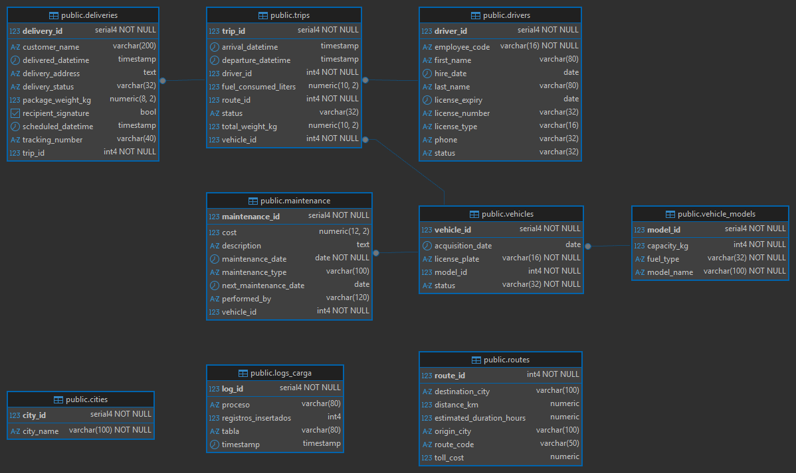

# FleetLogix: Generación de Datos Sintéticos y Modelo Relacional en PostgreSQL

Este proyecto integrador desarrolla una infraestructura de datos moderna para FleetLogix, una empresa de transporte y logística que opera una flota de 200 vehículos realizando entregas de última milla en cinco ciudades principales de Colombia.
El trabajo incluye la generación de más de 500.000 registros sintéticos realistas, el diseño y documentación del modelo relacional, la implementación de validaciones de calidad y KPIs operativos, y la propuesta de una arquitectura cloud escalable para análisis en tiempo real.

---

## Objetivos

- Poblar una base de datos PostgreSQL con más de 500.000 registros sintéticos realistas.
- Garantizar integridad referencial, consistencia temporal y calidad de datos.
- Documentar el modelo relacional y generar un diagrama ER profesional.
- Diseñar un modelo dimensional tipo estrella para análisis OLAP.
- Implementar queries operativas y KPIs logísticos.
- Proponer una arquitectura cloud escalable para análisis en tiempo real.

---

## Esquema SQL de generación de tablas
Ver script SQL 'fleetlogix_db_schema.sql'

---

## Datos sintéticos generados
- Deliveries: 400.001
- Trips: 100.000
- Maintenance: 5.000
- Drivers: 400
- Vehicles: 200
- Routes: 48

## Modelado de datos: ERD y esquema estrella

### Diagrama Entidad–Relación (ERD)

El modelo relacional de FleetLogix está compuesto por seis tablas interconectadas que reflejan los procesos logísticos de la empresa:

- **Maestras:** `vehicles`, `drivers`, `routes`
- **Transaccionales:** `trips`, `deliveries`, `maintenance`

Las relaciones están definidas mediante claves foráneas que garantizan integridad referencial. El diagrama ERD muestra dependencias, cardinalidades y restricciones únicas (placas, licencias, tracking numbers). Este modelo es óptimo para operaciones, pero no está diseñado para análisis multidimensional.

Diagrama ERD:

---

## Modelo estrella para análisis OLAP

Para habilitar análisis agregados y dashboards, se diseñó un esquema dimensional tipo estrella:
Este modelo permite responder preguntas como:
- ¿Qué tipo de vehículo tiene mejor tasa de entregas a tiempo?
- ¿Cómo varía el rendimiento por ciudad y por mes?
- ¿Qué conductores tienen mayor eficiencia por peso entregado?

---

## Diagrama Mermaid del modelo estrella
erDiagram

    fact_deliveries ||--o{ dim_vehicle : "utiliza"
    fact_deliveries ||--o{ dim_driver : "realizado por"
    fact_deliveries ||--o{ dim_route : "recorre"
    fact_deliveries ||--o{ dim_time : "programada en"

    dim_vehicle {
        int vehicle_id PK
        string license_plate UNIQUE
        string vehicle_type
        int capacity_kg
        string status
    }

    dim_driver {
        int driver_id PK
        string first_name
        string last_name
        string license_number UNIQUE
        date license_expiry
        string employment_status
    }

    dim_route {
        int route_id PK
        string route_code UNIQUE
        string origin_city
        string destination_city
        int distance_km
        float duration_hours
    }

    dim_time {
        date scheduled_date PK
        int year
        int month
        int day
        string weekday
        string period_of_day
    }

    fact_deliveries {
        int delivery_id PK
        int vehicle_id FK
        int driver_id FK
        int route_id FK
        date scheduled_date FK
        string tracking_number UNIQUE
        datetime scheduled_datetime
        datetime delivered_datetime
        string delivery_status
        float package_weight_kg
    }

## Validaciones de calidad

### Se implementaron queries para verificar:
- Integridad referencial (FK válidas)
- Consistencia temporal (arrival > departure)
- Coherencia de peso (no se excede capacidad del vehículo)
- Unicidad de claves (placas, licencias, tracking numbers)
✔ Todas las validaciones fueron exitosas.

---

## KPIs operativos

### Se calcularon métricas clave como:
- % de entregas a tiempo vs retrasadas
- Consumo promedio de combustible por tipo de vehículo
- Utilización de capacidad por viaje
- Mantenimientos por cada 1.000 km recorridos
- Promedio de entregas por viaje

---

## Ejecución

1. Abrir PowerShell.
2. Ir a la ubicación local de los scripts ejemplo: cd "RUTA\LOCAL\DE\LA\CARPETA"
Enter.
3. .\run_fleetlogix.ps1
Enter.
Si solicita contraseña es la definida en el script .py (puede pedirla una vez antes de crear la DB y otra vez antes de crear el esquema, es la misma ambas veces ya que es la del usuario).
4. Crear una nueva conexión para visualizar el esquema en DBeaver:
- Database -> New Database Connection -> PostgreSQL ->
- Rellenar con los parámetros definidos en el script:
Host: localhost
Port: 5432
Database: fleetlogixdb
Username: postgres
Password: fede0309

5. Verificar carga de datos
- En la misma DB abrir y ejecutrar las siguientes queries en cualquier orden, una a una o todas juntas:
'01_InventarioDeTablasPKsFKsIndices'
'02_ValidacionesCalidadConsistencia.sql'
'03_KPIsOperativosConsultasClave.sql'

---
## Autor
Federico Ceballos Torres.

- Este README fue elaborado como parte del proyecto integrador de la carrera Data Science en SoyHenry -